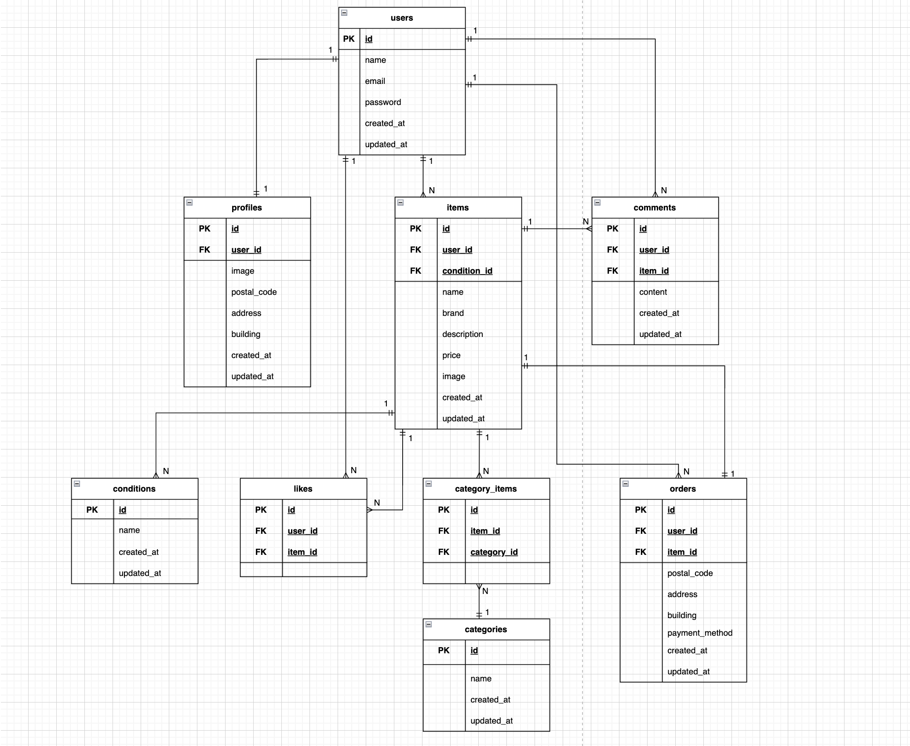

# coachtech-flea-market-app

### 環境構築

1. リポジトリをクローン

```bash

git clone git@github.com:3170sailing/coachtech-flea-market-app.git

```

2. プロジェクトへ移動

```bash

cd coachtech-flea-market-app

```

3. Dockerのビルド・起動

```bash

docker compose up -d --build

```

4. PHPコンテナへログイン

```bash

docker compose exec php bash

```

5. Composerパッケージインストール

```bash

composer install

```

6. .env作成

```bash

cp .env.example .env

```

7. 作成された.envのDB接続を変更

```bash

DB_CONNECTION=mysql

DB_HOST=mysql

DB_PORT=3306

DB_DATABASE=laravel_db

DB_USERNAME=laravel_user

DB_PASSWORD=laravel_pass

```

8. アプリの暗号化キー（APP_KEY）を生成

```bash

php artisan key:generate

```

9. マイグレーション実行

```bash

php artisan migrate

```

10. シーディング実行

```bash

php artisan db:seed

```

11. シンボリックリンク作成

```bash

php artisan storage:link

```

---

### Stripe決済機能

## Stripe決済機能について

本アプリではStripe Checkoutを利用して決済機能を実装しています。

Stripeを利用するため、各自でStripeアカウントを作成し、APIキーを取得してください。

`.env` に以下を設定してください。

```env

STRIPE_KEY=取得した公開キー
STRIPE_SECRET=取得したシークレットキー

```

Stripeのテスト決済を利用する場合は、Stripeダッシュボードで発行されるテスト用キーを設定してください。

※APIキーは環境ごとに異なるため、各自の環境に合わせて設定が必要です。

## テストカード番号

Stripeテスト環境では以下のカード番号を利用できます。

```text

カード番号：4242 4242 4242 4242
有効期限：任意の未来日
CVC：任意の3桁

```

## 決済フロー

1. 商品詳細画面から購入手続きへ遷移
2. 配送先・支払方法を選択
3. Stripe Checkoutへ遷移
4. テストカードで決済
5. 決済完了後、購入情報を保存
6. マイページの購入した商品一覧へ表示

---


### 実装内容

* 商品購入画面で支払方法を選択
* 購入ボタン押下時に Stripe Checkout セッションを作成
* Stripeの決済画面へ遷移
* 決済完了後、購入完了画面へリダイレクト
* 購入情報を orders テーブルへ保存

---

## 使用技術

* PHP 8.0
* Laravel 8.x
* MySQL 8.0
* Docker
* Laravel Fortify
* Stripe Checkout

---

## PHPUnitテスト

本アプリでは、PHPUnitを用いて各機能のFeatureテストを実装しています。

### テスト実行方法

1. PHPコンテナへログイン

```bash

docker compose exec php bash

```

2. .env.testingを作成

```bash

cp .env .env.testing

```

3. .env.testing のデータベース設定をテスト用に変更

```env

APP_ENV=testing
DB_CONNECTION=mysql
DB_HOST=mysql
DB_PORT=3306
DB_DATABASE=laravel_test
DB_USERNAME=laravel_user
DB_PASSWORD=laravel_pass

```

4. MySQLコンテナへログイン

```bash

docker compose exec mysql bash

```

5. MySQLへ接続

```bash

mysql -u root -p

```

6. テスト用データベースを作成

```sql

CREATE DATABASE laravel_test;
EXIT;

```

7. PHPコンテナ内でテスト用データベースへマイグレーション

```bash

php artisan migrate:fresh --seed --env=testing

```

8. すべてのテストを実行

```bash

php artisan test

```

### テスト結果

```text

Tests: 38 passed
Time: 0.54s

```

---

## ER図



---

## URL

### 開発環境

```text

http://localhost

```

### phpMyAdmin

```text

http://localhost:8080

```

---

# 機能一覧

* 会員登録
* ログイン
* ログアウト
* 商品一覧表示
* 商品詳細表示
* 商品検索
* マイリスト表示
* いいね機能
* コメント機能
* 商品出品
* 商品購入
* 配送先変更
* Stripe決済
* プロフィール編集
* プロフィール画像アップロード

---

# テーブル設計

## users

| カラム名       | 型               | Primary key | Unique key | Not null | Foreign key | 説明      |
| ---------- | --------------- | ----------- | ---------- | -------- | ----------- | ------- |
| id         | unsigned bigint | ○           |            | ○        |             | 主キー     |
| name       | varchar(255)    |             |            | ○        |             | ユーザー名   |
| email      | varchar(255)    |             | ○          | ○        |             | メールアドレス |
| password   | varchar(255)    |             |            | ○        |             | パスワード   |
| created_at | timestamp       |             |            |          |             | 作成日時    |
| updated_at | timestamp       |             |            |          |             | 更新日時    |

---

## profiles

| カラム名        | 型               | Primary key | Unique key | Not null | Foreign key | 説明            |
| ----------- | --------------- | ----------- | ---------- | -------- | ----------- | ------------- |
| id          | unsigned bigint | ○           |            | ○        |             | 主キー           |
| user_id     | unsigned bigint |             |            | ○        | ○           | usersテーブル外部キー |
| image       | varchar(255)    |             |            |          |             | プロフィール画像      |
| postal_code | varchar(20)     |             |            |          |             | 郵便番号          |
| address     | varchar(255)    |             |            |          |             | 住所            |
| building    | varchar(255)    |             |            |          |             | 建物名           |
| created_at  | timestamp       |             |            |          |             | 作成日時          |
| updated_at  | timestamp       |             |            |          |             | 更新日時          |

---

## items

| カラム名         | 型               | Primary key | Unique key | Not null | Foreign key | 説明                 |
| ------------ | --------------- | ----------- | ---------- | -------- | ----------- | ------------------ |
| id           | unsigned bigint | ○           |            | ○        |             | 主キー                |
| user_id      | unsigned bigint |             |            | ○        | ○           | usersテーブル外部キー      |
| condition_id | unsigned bigint |             |            | ○        | ○           | conditionsテーブル外部キー |
| name         | varchar(255)    |             |            | ○        |             | 商品名                |
| brand        | varchar(255)    |             |            |          |             | ブランド名              |
| description  | text            |             |            | ○        |             | 商品説明               |
| price        | integer         |             |            | ○        |             | 価格                 |
| image        | varchar(255)    |             |            | ○        |             | 商品画像               |
| created_at   | timestamp       |             |            |          |             | 作成日時               |
| updated_at   | timestamp       |             |            |          |             | 更新日時               |

---

## categories

| カラム名       | 型               | Primary key | Unique key | Not null | Foreign key | 説明     |
| ---------- | --------------- | ----------- | ---------- | -------- | ----------- | ------ |
| id         | unsigned bigint | ○           |            | ○        |             | 主キー    |
| name       | varchar(255)    |             |            | ○        |             | カテゴリー名 |
| created_at | timestamp       |             |            |          |             | 作成日時   |
| updated_at | timestamp       |             |            |          |             | 更新日時   |

---

## category_items

| カラム名        | 型               | Primary key | Unique key | Not null | Foreign key | 説明                 |
| ----------- | --------------- | ----------- | ---------- | -------- | ----------- | ------------------ |
| id          | unsigned bigint | ○           |            | ○        |             | 主キー                |
| category_id | unsigned bigint |             |            | ○        | ○           | categoriesテーブル外部キー |
| item_id     | unsigned bigint |             |            | ○        | ○           | itemsテーブル外部キー      |

---

## conditions

| カラム名 | 型               | Primary key | Unique key | Not null | Foreign key | 説明   |
| ---- | --------------- | ----------- | ---------- | -------- | ----------- | ---- |
| id   | unsigned bigint | ○           |            | ○        |             | 主キー  |
| name | varchar(255)    |             |            | ○        |             | 商品状態 |

---

## likes

| カラム名    | 型               | Primary key | Unique key | Not null | Foreign key | 説明            |
| ------- | --------------- | ----------- | ---------- | -------- | ----------- | ------------- |
| id      | unsigned bigint | ○           |            | ○        |             | 主キー           |
| user_id | unsigned bigint |             |            | ○        | ○           | usersテーブル外部キー |
| item_id | unsigned bigint |             |            | ○        | ○           | itemsテーブル外部キー |

---

## comments

| カラム名    | 型               | Primary key | Unique key | Not null | Foreign key | 説明            |
| ------- | --------------- | ----------- | ---------- | -------- | ----------- | ------------- |
| id      | unsigned bigint | ○           |            | ○        |             | 主キー           |
| user_id | unsigned bigint |             |            | ○        | ○           | usersテーブル外部キー |
| item_id | unsigned bigint |             |            | ○        | ○           | itemsテーブル外部キー |
| content | varchar(255)    |             |            | ○        |             | コメント内容        |

---

## orders

| カラム名           | 型               | Primary key | Unique key | Not null | Foreign key | 説明            |
| -------------- | --------------- | ----------- | ---------- | -------- | ----------- | ------------- |
| id             | unsigned bigint | ○           |            | ○        |             | 主キー           |
| user_id        | unsigned bigint |             |            | ○        | ○           | usersテーブル外部キー |
| item_id        | unsigned bigint |             |            | ○        | ○           | itemsテーブル外部キー |
| postal_code    | varchar(20)     |             |            | ○        |             | 郵便番号          |
| address        | varchar(255)    |             |            | ○        |             | 配送先住所         |
| building       | varchar(255)    |             |            |          |             | 建物名           |
| payment_method | varchar(50)     |             |            | ○        |             | 支払方法          |
| created_at     | timestamp       |             |            |          |             | 作成日時          |
| updated_at     | timestamp       |             |            |          |             | 更新日時          |
